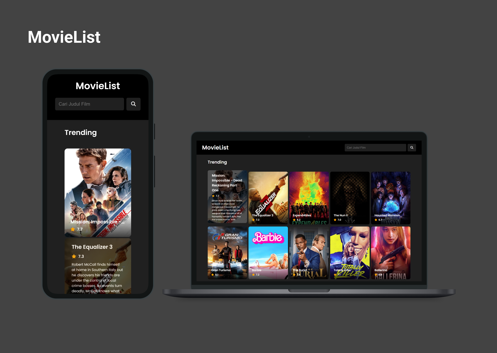

# MovieList

The MovieList app is created as part of the 'Fundamental FE' course on Dicoding. It allows users to browse and discover information about movies. The movie data is sourced from **TheMovieDB** API.

## Prerequisites

Before you begin, make sure you have obtained an API key from [TheMovieDB](https://www.themoviedb.org/) and replace the `API_KEY` variable in the code with your own API key.

## Technologies Used

- Axios
- Custom Element
- Webpack
- ESLint (Code Quality)

## Snapshots
